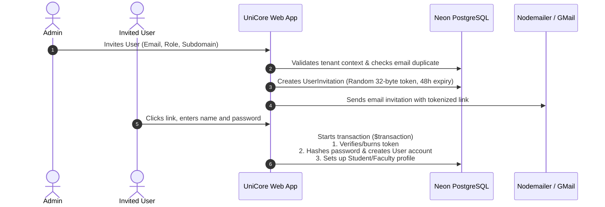
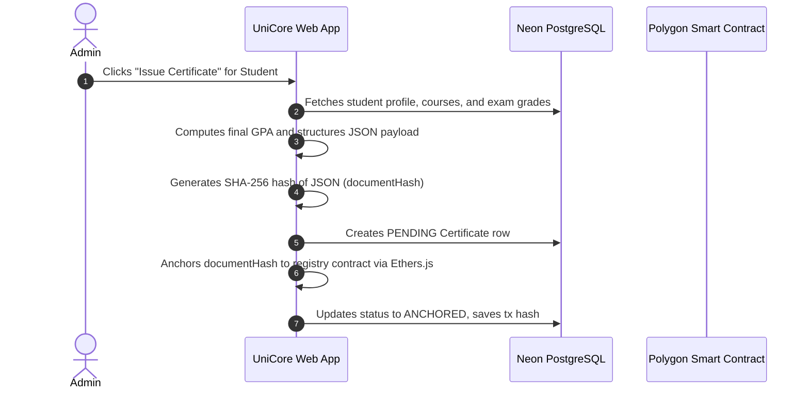

# UniCore

### Next-Gen Multi-Tenant Academic ERP & Blockchain Credential Registry

UniCore is a multi-tenant SaaS Enterprise Resource Planning (ERP) and Learning Management System (LMS) designed for modern educational institutions. It features a dynamically modular subscription system, strict path-based tenant isolation, and a blockchain-anchored credential registry that dynamically audits database integrity to prevent academic fraud.

---

## 🏗️ System Architecture & Tech Stack

UniCore is built on a modern, decoupled stack designed for high availability, transactional safety, and low-latency rendering in serverless environments.

* **Application Framework**: Next.js 16 (App Router) & React 19 (Server/Client components).
* **Database & Access Layer**: PostgreSQL (Neon Serverless) mapped with **Prisma ORM**.
* **Authentication**: Stateless, JWT-based secure session cookies utilizing `bcryptjs` and `jsonwebtoken`.
* **Distributed Ledger Registry**: Ethereum Smart Contracts written in **Solidity** using the **Hardhat** framework, deployed on the **Polygon Amoy Testnet** via **Ethers.js (v6)**.

---

## 🔄 Core Workflows

The platform leverages transactional workflows to maintain state consistency across PostgreSQL and the blockchain ledger.

### 1. User Invitation & Onboarding Flow
Administrators onboard students and faculty securely without handling passwords directly.



### 2. Blockchain Academic Credential Registry
UniCore issues tamper-proof graduation certificates by anchoring hashes to Polygon.



---

## 🛠️ Key Engineering Features

### 🏢 Path-Based Multi-Tenancy & Layout Isolation
Multi-tenancy is handled dynamically via routing segments (configured at `lib/config.ts`).
* **Request Interception**: A custom routing middleware ([proxy.ts](file:///c:/Users/mohit/Desktop/unicore/proxy.ts)) inspects incoming requests, filters out global routes (like `/login`, `/register`, or `/api`), extracts the first pathname segment as the tenant identifier, and forwards it to downstream headers (`x-tenant-slug` and `x-tenant-id`).
* **Context Resolution**: Server layouts ([app/[tenant]/layout.tsx](file:///c:/Users/mohit/Desktop/unicore/app/[tenant]/layout.tsx)) retrieve this header, verify the tenant against database records, and render layout assets customized to that institution. If the tenant slug is invalid, it throws a `404 Not Found`.

### 🧩 Modular Subscription Licensing
Institutions can toggle optional modules (e.g., `attendance`, `exams`, `results`, `timetable`, `notices`) based on their subscription tier:
* Core features like departments, courses, and directories are enabled by default.
* During page requests or API access, `isModuleEnabled` ([lib/modules/loader.ts](file:///c:/Users/mohit/Desktop/unicore/lib/modules/loader.ts)) queries `ModuleSubscription` database overrides.
* The system enforces **dependency resolution chains** (defined in `lib/modules/registry.ts`). For example, enabling the `results` module automatically checks if the `exams` module dependency is active. If the dependency is missing, the module loader programmatically disables the dependent feature to prevent layout crashes.

### ⚡ Database Transaction Safety (ACID)
Academic grading requires absolute consistency. When instructors record grades in bulk, the grades ingestion endpoint ([app/api/modules/exams/results/route.ts](file:///c:/Users/mohit/Desktop/unicore/app/api/modules/exams/results/route.ts)) executes the write queries inside a **Prisma database transaction** (`$transaction`). If any single query in the batch fails validation constraints (e.g., scoring higher than the maximum marks allowed), the transaction rolls back completely to prevent data corruption.

---

## 🔒 Security Design Decisions

### 🔍 Dynamic Integrity Audits
Checking if a certificate hash exists on the blockchain is not enough to prevent fraud. If a bad actor modifies grades directly in PostgreSQL, a standard verification check would query the blockchain, see the original valid transaction, and falsely confirm the certificate.

UniCore implements a **Dynamic Integrity Audit**:
* During verification ([lib/services/certificate-service.ts](file:///c:/Users/mohit/Desktop/unicore/lib/services/certificate-service.ts)), the application queries the student's *current live* grading records from the database.
* It recalculates the final GPA, reconstructs the JSON certificate metadata, and hashes it.
* It compares this recalculated `liveHash` with the `documentHash` anchored on-chain. If any grade was manipulated directly in the database, the hashes mismatch, immediately flagging **"Data Tampering Detected"**.

### ⚛️ Deterministic Hashing & Date Sanitization
To ensure recalculations are stable across different systems, environments, and updates:
* **JSON Key Canonicalization**: Standard JS serialization (`JSON.stringify`) does not guarantee object key order. If keys rearrange, the generated hashes mismatch. For production, UniCore utilizes alphabetical key sorting before hashing to guarantee deterministic outputs.
* **Deterministic Date Serialization**: Native dates can serialize with milliseconds (e.g. `.123Z`) which database engines might truncate. The application sanitizes date strings during hashing to a second-precision ISO-8601 string format (`YYYY-MM-DDTHH:MM:SSZ`), ensuring identical byte streams across both issuance and verification.

### 🔑 Stateless Single-Use Tokens
Password resets use dynamic secrets: `JWT_SECRET + user.passwordHash`. 
When a user updates their password, their database `passwordHash` changes. This immediately renders all previously generated reset links invalid because the signature verification key no longer matches, creating single-use tokens without storing token blacklists in database tables.

### 🌐 Cross-Tenant Privilege Isolation
Horizontal privilege escalation is prevented at the database queries layer. The application does not lookup resources globally by ID. Every query bounds searches to the user's validated session:
```typescript
const course = await prisma.course.findFirst({
  where: { id: courseId, institutionId: user.institutionId }
});
```
Even if a user manually guesses an ID belonging to another tenant, the query returns `null` because the record does not match their session's `institutionId`.

---

## ⚙️ Performance Tuning in Serverless

When deploying Next.js server components on Neon Postgres (a serverless database), client connections are automatically closed during idle periods to save resources. When a new request triggers a container spin-up, connection delays (cold starts) can exceed default timeouts.

To mitigate this, UniCore configures global transaction parameters on the Prisma client ([lib/db/index.ts](file:///c:/Users/mohit/Desktop/unicore/lib/db/index.ts)):
```typescript
export const prisma = new PrismaClient({
  adapter,
  transactionOptions: {
    maxWait: 15000, // 15 seconds to acquire a connection from the pool
    timeout: 30000,  // 30 seconds total execution time before rolling back
  },
})
```
This configuration cushions the database connection latency, preventing timeout errors during serverless scaling.

---

## 🚀 Installation & Local Development

### 1. Install Dependencies
```bash
npm install
```

### 2. Environment Setup
Create a `.env` file in the root directory and add your PostgreSQL connection, mail server settings, and Polygon configuration.

### 3. Generate Prisma Client
```bash
npx prisma generate
```

### 4. Sync Database Schema
```bash
npx prisma db push
```

### 5. Run the Local Server
```bash
npm run dev
```
Open [http://localhost:3000](http://localhost:3000) in your browser.
