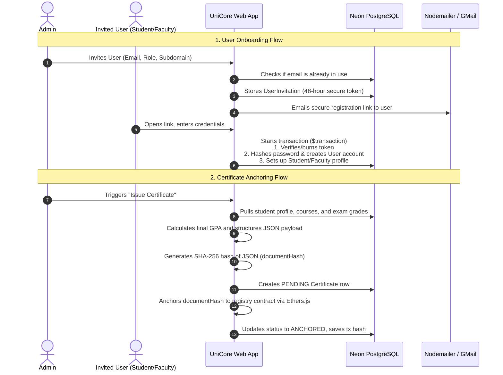

# Deep Dive: UniCore System Architecture & Interview Guide

UniCore is a multi-tenant SaaS platform that brings Enterprise Resource Planning (ERP) and Learning Management System (LMS) features to educational institutions. Built for scale, it uses a modular setup, secure role-based access control, and a blockchain-anchored registry to verify academic certificates.

---

## 1. System Architecture & Core Workflows

### Technical Stack & Setup
* **Frontend/Framework**: Next.js 16 (utilizing App Router), React 19, TypeScript, styled with Tailwind CSS.
* **Database**: PostgreSQL (hosted serverless on Neon) connected via **Prisma ORM**.
* **Session Management**: Stateless authentication using JWT cookies, secured with `bcryptjs` and `jsonwebtoken`.
* **Blockchain Registry**: Solidity smart contracts compiled, tested, and deployed via **Hardhat**. The system connects to the **Polygon Amoy Testnet** using **Ethers.js (v6)**.

---

### Key Workflows



#### A. Multi-Tenant Request Routing & Isolation
UniCore separates institutional data dynamically. Depending on the environment, it routes via pathname segments or subdomains (configured at `lib/config.ts#L11`):
1. **Request Interception**: The system's routing middleware ([proxy.ts](file:///c:/Users/mohit/Desktop/unicore/proxy.ts)) inspects the incoming request URL. It skips standard system paths (like `/api`, `/login`, or `/register`) and extracts the first directory segment as the tenant identifier, passing it downstream via custom headers (`x-tenant-slug` and `x-tenant-id`).
2. **Layout-Level Guards**: In [app/[tenant]/layout.tsx](file:///c:/Users/mohit/Desktop/unicore/app/[tenant]/layout.tsx), server-rendered layouts read this tenant slug, verify its existence against active database records, and throw a `404 Not Found` if the tenant does not exist.
3. **API Level Boundaries**: The `withAuth` route wrapper ([lib/auth-middleware.ts](file:///c:/Users/mohit/Desktop/unicore/lib/auth-middleware.ts)) acts as a boundary. It decodes the user's JWT, extracts their home tenant, and ensures it matches the tenant path they are requesting. Cross-tenant access attempts immediately yield a `403 Forbidden`.

#### B. Dynamic Feature Flags & Dependencies
Optional modules (e.g., `attendance`, `exams`, `results`, `timetable`, `notices`) are loaded conditionally based on an institution's subscription:
* Core features like user directory management and basic course listings are always active.
* Whenever a user hits an endpoint or layout widget, `isModuleEnabled` ([lib/modules/loader.ts](file:///c:/Users/mohit/Desktop/unicore/lib/modules/loader.ts)) queries `ModuleSubscription` overrides in the database.
* The system enforces **logical dependency chains**. For instance, if an administrator enables `results` but `exams` is disabled, the module manager programmatically blocks `results` because it relies on `exams` data ([lib/modules/registry.ts#L102](file:///c:/Users/mohit/Desktop/unicore/lib/modules/registry.ts#L102)).

#### C. Bulk Operations & Database Integrity
* When instructors log student marks, they hit the grades ingestion API ([app/api/modules/exams/results/route.ts](file:///c:/Users/mohit/Desktop/unicore/app/api/modules/exams/results/route.ts)).
* The system processes all database updates inside a **Prisma transaction** (`$transaction`). If any record violates maximum mark bounds, the transaction rolls back the entire batch to prevent partial updates and data corruption.

#### D. Dynamic Integrity Audits via Blockchain Anchoring
UniCore keeps student credentials tamper-proof without exposing sensitive data:
1. **Hashing Data**: Writing complete academic transcripts to a public blockchain violates privacy laws (like GDPR) and is expensive. Instead, UniCore serializes the student's final grades and GPA into a standard JSON metadata descriptor. It then generates a **SHA-256 hash** (`documentHash`) of this string.
2. **On-Chain Recording**: The `CertificateRegistry.sol` smart contract exposes an `anchorCertificate` method (restricted to the contract owner). This method stores the `documentHash` along with the issuance timestamp on-chain.
3. **Automated Audit Checks** ([lib/services/certificate-service.ts#L122](file:///c:/Users/mohit/Desktop/unicore/lib/services/certificate-service.ts#L122)): When verifying a certificate, the system does not just rely on the stored static hash. It queries the student's *current* live exam records in PostgreSQL, recalculates their GPA, reconstructs the JSON payload, and hashes it. If this recalculation (`liveHash`) doesn't match the anchored `documentHash`, the verification portal warns **"Data Tampering Detected"**—catching unauthorized direct database edits.

---

## 2. Technical Interview Questions & Answers

### Q1: The configuration includes `hardhat.config.cjs` and deployment files with the `.cjs` extension. Why are we using `.cjs` instead of `.ts` or `.js`? What problem does this solve?
**Context:** *Tests your knowledge of Node.js module ecosystems (CommonJS vs. ES Modules).*

**Answer:**
Since our `package.json` specifies `"type": "module"`, the Node.js runtime treats all standard `.js` and `.ts` files as ES Modules (which use `import/export` syntax). 
However, **Hardhat** executes in a CommonJS runtime environment under the hood. When running scripts, it expects files to use CommonJS style module exports and dynamically injects its runtime environment via `require` statements.
By using the `.cjs` extension, we force Node to treat these scripts as CommonJS modules. This lets us use CommonJS syntax (`require("hardhat")`) safely, avoiding module loader mismatches in an ESM-configured Next.js project.

---

### Q2: Let's discuss the "Dynamic Integrity Audit" in `CertificateService.verifyCertificate`. What specific security risk does this architecture address? Why isn't checking the blockchain hash by itself enough?
**Context:** *Evaluates security design choices and understanding of blockchain limits.*

**Answer:**
This architecture prevents **database-level tampering** by rogue employees or hackers. 
If an attacker gains write access to our PostgreSQL database, they could change a student's grade records in the `ExamResult` table to boost their GPA.

If our verification check only queried the blockchain to see if the certificate hash is valid, it would find the original `documentHash` on-chain and declare it authentic. However, the dynamically rendered certificate page would pull the manipulated, inflated GPA from the database.

By running a **Dynamic Integrity Audit**:
1. We fetch the live grading records directly from PostgreSQL.
2. We rebuild the JSON structure and re-hash it.
3. We cross-examine this new hash against the stored `documentHash` linked on-chain.
If anyone altered database records, the hashes will mismatch, flagging `isDataTampered: true` and exposing the database breach.

---

### Q3: In `CertificateService.verifyCertificate`, the code uses `JSON.stringify(currentData)` to prepare the data for hashing. What is the main bug or hazard associated with hashing standard serialized JSON strings? How would you resolve it for production?
**Context:** *Tests your knowledge of JS serialization quirks and cryptographic reliability.*

**Answer:**
JavaScript objects do not guarantee key order. Running:
```typescript
const currentDataStr = JSON.stringify(currentData);
```
tends to serialize properties in the order they were inserted. If keys are added, refactored, or if the JS runtime changes key sorting rules (like during updates), the string output changes:
*   `{"name":"Bob","gpa":"3.8"}`
*   `{"gpa":"3.8","name":"Bob"}`

Even though the semantic data is identical, these strings produce different SHA-256 hashes, leading to false-positive verification failures.

**Production Fix:**
Use a **JSON Canonicalization Scheme (JCS)** matching RFC 8785, or utilize libraries like `canonical-json` or `fast-safe-stringify` to sort object keys alphabetically and recursively before generating the hash.

---

### Q4: The password reset flow constructs a dynamic JWT secret: `JWT_SECRET + currentHash`. What security benefit does this offer over using a static JWT secret?
**Context:** *Tests your knowledge of session security and stateless authorization.*

**Answer:**
When using a static `JWT_SECRET`, a password reset token remains valid until its expiration time passes. If a user resets their password but the email link is intercepted, an attacker could reuse that same link within its validity window. Statically preventing this requires maintaining a database table of blacklisted tokens.

By appending the user's current password hash (`currentHash`) to the secret:
1. When the user updates their password, the database saves a new `passwordHash`.
2. If someone tries to reuse the old token, `verifyResetToken` validates it using the *new* hash.
3. The dynamic signature verification fails because the secret key changed.
This provides **stateless, single-use** reset tokens that invalidate themselves immediately upon a password change, with no database tracking required.

---

### Q5: Look at the routing middleware in `proxy.ts`. How does it distinguish between system-wide routes (like `/login` or `/register`) and tenant-specific paths?
**Context:** *Tests Next.js middleware, routing mechanics, and URL parsing.*

**Answer:**
The middleware maintains an explicit blacklist array called `reservedRootPaths`:
```typescript
const reservedRootPaths = [
  'login', 'register', 'demo', 'docs', 'about', 'contact', 'admin', 'faculty', 'student'
];
```
When an HTTP request is intercepted:
1. The middleware parses the pathname segment by segment.
2. It checks if the first path segment matches any value inside `reservedRootPaths`.
3. If it matches a reserved route, the middleware lets the request pass through untouched (e.g., `/login` goes directly to the global portal).
4. If it doesn't match, it assumes the segment is a tenant identifier (e.g., `/mit/dashboard` represents tenant `mit`) and appends routing headers.
This prevents the router from incorrectly treating global pages as tenant subdomains.

---

### Q6: If we change `routingStrategy` in `lib/config.ts` from `'path'` to `'subdomain'`, how must we configure the client session cookie (`auth_token`) so users don't have to log in again when switching domains?
**Context:** *Tests browser cookie scopes and cross-subdomain authentication.*

**Answer:**
By default, web browsers limit cookie visibility to the specific domain that created them (e.g. `mit.unicore.com` cannot read cookies set by `harvard.unicore.com`).
To enable cross-subdomain sharing:
1. We must set the `domain` option of the `auth_token` cookie to the wildcard parent domain (e.g., `.unicore.com` instead of a specific subdomain).
2. Configure this option during cookie creation in our authentication handler:
   ```typescript
   cookies().set('auth_token', token, {
     domain: '.unicore.com', // Share session across all subdomains
     httpOnly: true,
     secure: true,
     sameSite: 'lax',
   });
   ```
*Note:* This does expand the security surface area. If one tenant's subdomain (`hackme.unicore.com`) is vulnerable to cross-site scripting (XSS), the attacker could access this wildcard cookie to hijack sessions on other tenants' domains.

---

### Q7: In the `POST` handler for exam results (`results/route.ts`), we write marks in a `$transaction`. Why is this approach better than executing queries concurrently using `Promise.all`?
**Context:** *Tests transaction management, concurrency, and connection safety in database operations.*

**Answer:**
1. **Atomicity**: If we use `Promise.all` and a single query fails (due to invalid inputs, connection drops, etc.), database writes that already completed are saved, while the rest are dropped. This leaves student grades in a partially saved, corrupted state. A database transaction ensures all operations succeed or fail together.
2. **Business Rules Validation**: During the update loop, we check that student scores do not exceed the maximum allowed exam marks. Throwing an error inside the transaction rollback discards all changes, keeping database records clean.
3. **Connection Pooling**: Running a large batch of concurrent writes using `Promise.all` can quickly exhaust database connection pools, especially when using serverless databases like Neon. A transaction handles these updates sequentially and safely within a single connection block.

---

### Q8: In `CertificateService.issueCertificate`, we write a `PENDING` certificate database record before calling the blockchain wallet to anchor it. Why do we write to the database first?
**Context:** *Tests async state design, handling third-party latency, and error resilience.*

**Answer:**
This order protects against **orphaned actions and state tracking failures**:
1. **Network Latency**: Mining a transaction on-chain takes time. If we anchored first and the connection dropped or the server crashed before writing to our database, we would have spent gas to write to the ledger with no local record of who the certificate belongs to.
2. **Crash Recovery**: Creating a local database record marked as `PENDING` registers the intent. If the subsequent blockchain call fails (due to wallet issues, low gas, or API timeouts), the certificate state drops to `FAILED`. A background job or administrator can then locate failed entries and safely retry anchoring them.

---

### Q9: The smart contract `CertificateRegistry.sol` restricts updates with `onlyOwner`. What are the security risks if `BLOCKCHAIN_PRIVATE_KEY` is leaked? How do you secure it for production?
**Context:** *Tests smart contract administration, key security, and ledger access control.*

**Answer:**
If the private key is exposed, an attacker could sign and anchor fake certificates under our institution's registry. They cannot rewrite or erase *existing* records because the smart contract checks:
`require(!certificates[documentHash].exists, "Certificate already anchored")`
However, the validity of the verification service is broken if attackers can append new fake records.

**Production Mitigations:**
1. **Multi-signature Setup**: Hand over contract ownership to a multi-signature wallet (like a Gnosis Safe) requiring approvals from several independent administrative keys before performing updates.
2. **Role-Based Access Control (RBAC)**: Adjust the contract to authorize a list of dynamic "Institution Issuers" that can be suspended or revoked if a key is compromised.
3. **Secure Key Management (HSM)**: Store private keys in cloud HSM systems (like Google Cloud KMS, AWS KMS, or HashiCorp Vault) rather than environment files on application servers.

---

### Q10: How does `lib/db/index.ts` optimize connection handling to deal with serverless database "Cold Starts" on Neon?
**Context:** *Tests performance tuning, serverless databases, and Prisma timeout controls.*

**Answer:**
In serverless environments like Neon, database connection adapters spin down idle clients. When a new function executes, establishing the first database connection takes extra time.
To handle these delays without crashing the application, we configure the Prisma Client's global transaction parameters:
```typescript
export const prisma = new PrismaClient({
  adapter,
  transactionOptions: {
    maxWait: 15000, // Wait up to 15 seconds to acquire a connection from the pool
    timeout: 30000,  // Wait up to 30 seconds for transaction execution before rolling back
  },
})
```
This increases transaction times, allowing serverless functions extra time to spin up and connect. Using `@prisma/adapter-neon` also lets Prisma queries run over WebSockets or HTTP, which avoids exhausting Neon's TCP connection limits.

---

### Q11: In `CertificateService.issueCertificate`, the timestamp is formatted as:
`const issueDateStr = new Date().toISOString().split('.')[0] + "Z";`
### Why is this formatting critical for the dynamic integrity verification hash to succeed?
**Context:** *Tests deterministic date serialization and timezone consistency.*

**Answer:**
A standard JS Date `toISOString()` yields a string containing milliseconds, e.g., `2024-11-20T08:35:10.123Z`. 
When saving this date to the database, PostgreSQL (or Prisma) might truncate milliseconds or apply timezone offsets depending on configuration.

If we don't normalize the date format:
1. The initial certificate hash would be generated using the millisecond-precision string: `2024-11-20T08:35:10.123Z`.
2. During verification, we pull the date from the database, which might yield `2024-11-20T08:35:10Z` (sans milliseconds).
3. The reconstructed JSON yields a different string and re-hashing it fails the integrity check.

By splitting on `.` and appending `Z`, we enforce a deterministic second-precision ISO-8601 string (`YYYY-MM-DDTHH:MM:SSZ`) across both issuance and verification, guaranteeing identical serializations.

---

### Q12: How does the system prevent horizontal privilege escalation (e.g., a Faculty member from Tenant A accessing or marking attendance for Tenant B)?
**Context:** *Enforcing security boundaries and authorization logic in multi-tenant environments.*

**Answer:**
We validate authorization boundaries at two distinct levels:
1. **Token Boundaries**: The middleware checks that the user's authenticated `institutionId` matches their target directory slug.
2. **Scoped Database Queries**: We never fetch or update records globally by ID alone. For example, during attendance marking:
   ```typescript
   const course = await prisma.course.findFirst({
     where: { id: courseId, institutionId: user.institutionId }
   });
   ```
   Instead of querying by `courseId` directly, we use `findFirst` and constrain the search with the caller's `institutionId`. Even if a user guesses a valid database ID belonging to another tenant, the query returns `null` because the tenant constraint is not met.
